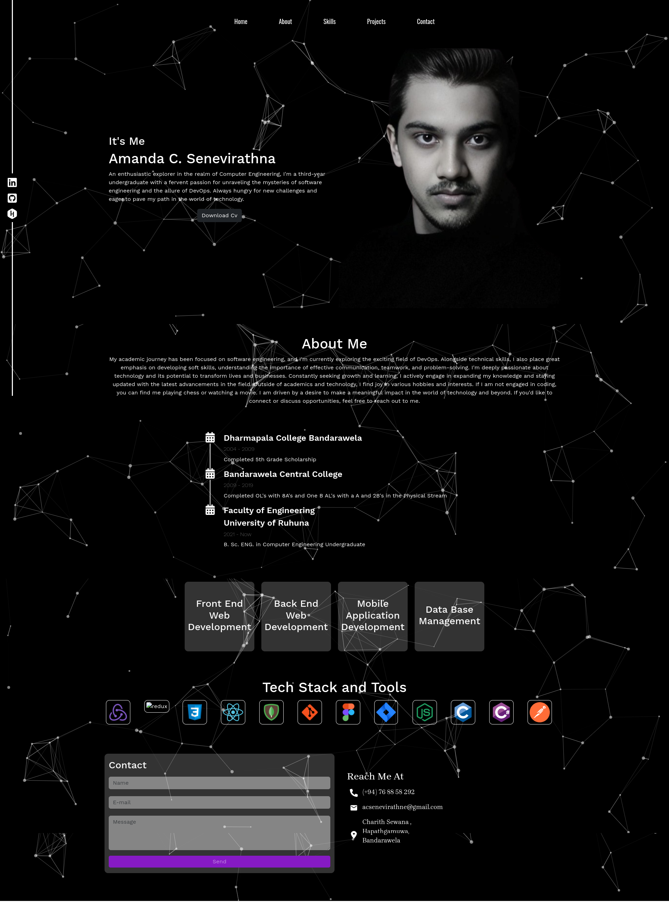

# My_Profile Portfolio Website

This repository contains the code for my personal portfolio website project, built using the MERN stack. The website is hosted on the domain [acsenevirathna.great-site.net](https://acsenevirathna.great-site.net).

## Screenshots

You can find screenshots of the website in the `ss` folder. Here's a preview:



## Technologies Used

- MongoDB
- Express.js
- React.js
- Node.js

## Project Structure

The React project directory is named `front end`. Within this directory, you'll find the front-end codebase for the website.

## How to Run

To run the project locally, follow these steps:

1. Clone the repository:

   ```bash
   git clone https://github.com/ACSENEVIRATHNA/My_Profile.git
   ```

2. Navigate to the project directory:

   ```bash
   cd My_Profile
   ```

3. Install dependencies for both the server and the client:

   ```bash
   cd front end
   npm install

4. Start the server:

   ```bash
   npm start
   ```

5. Open your browser and visit `http://localhost:3000` to view the website.

## Contributing

Contributions are welcome. If you find any issues or want to contribute enhancements, feel free to open a pull request.

## License

This project is licensed under the [MIT License](LICENSE). Feel free to use the code as a reference for your own projects.
